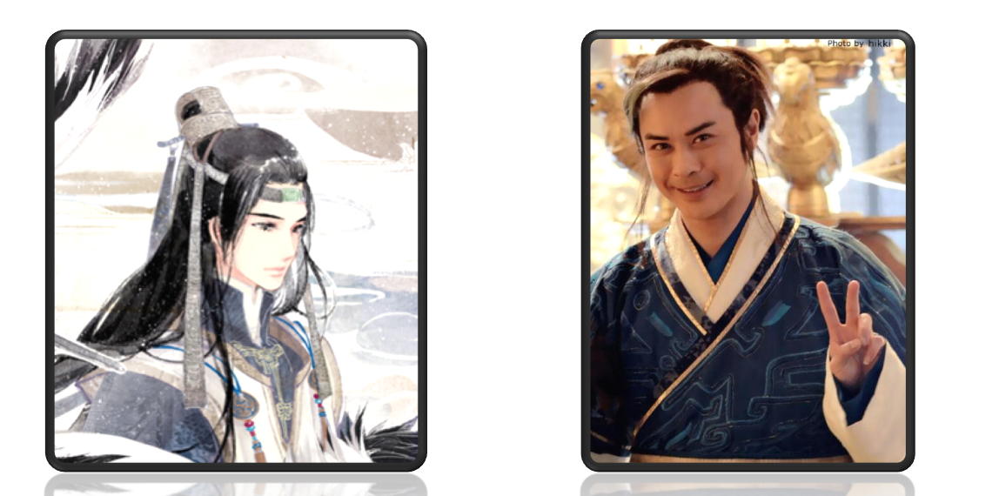
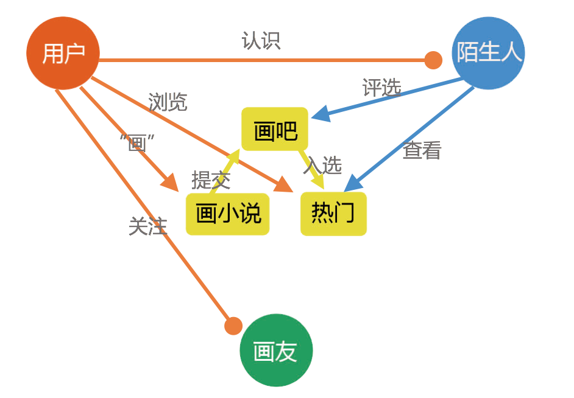

# NovelDrawing —— 画小说

> Imagine Cup 2015 参赛作品

### 1. 背景

现如今，阅读小说是广大中青年不可缺少的爱好之一。而每部小说中最不可缺的就是**人物角色**，每个人对人物角色的理解不一样，那么这个角色在每个人心目中的形象也都不一样。 

每个人都对小说中的人物角色形象有所想象，但目前大家也只是想象而已，有美术功底或是设计功底的可以手绘或用画图软件来将自己的**“想象”现实化**，可是大众们却不能。而且，每当有自己喜爱的小说被改编成影视作品时，广大群众的大多数反应都是“惨不忍睹”， 选角和自己心目中的角色形象相差太远，实为让人心碎。

比如： 很可能你心目中的小龙女可能是这样的（左图），但电视剧中的小龙女却是这样的（右图）

很可能你心目中的慕言可能是这样的（左图），但电视剧中的慕言却是这样的（右图）

因此，我们从自身出发，站在大众需求的角度，想做出一款服务于大众的产品，即给大家提供一个能“画”出“它”们的平台，用“傻瓜式“的操作，简单容易的就能”画“出心中所想。经过对以上问题的思考、细化和扩展，我们设计了这款**以绘制角色为主线，功能多样化的“画小说”移动应用软件**。

### 2. 产品的初步功能设计如下图:

主要功能有:

(1) “画“出心目中的小说角色(用五官、身体等部件拼接，也可拉伸扭转、放大缩小)

(2) 在线分享——晒出用户自己的“作品”、打赏自己喜爱的“ 作品”

(3) 官方定期举办评比会，用户可选出某部小说中最符合你心目中角色的形象

(4) 引进小说作者入驻，拉近与读者的距离

(5) 用户可自助建立“画吧”，讨论小说，分享自己的作品

(6) 结交“画友”，在线聊天

(7) 登录注册等功能

上述功能特点:

(1) `小说 + 拼脸`，创新融合——填补市场空白

(2) `兴趣 + 娱乐 + 社交`，产品功能综合 —— 打造一个小说爱好者的互动”天堂“

### 3. 产品适用场景

(1)小说爱好者阅读小说时，对小说中的人物角色形象有所”想象“，但因无绘画基础，无法 “画“出心中所想。

(2)小说爱好者想要找到与自己志同道合的人。

(3)小说作者想和自己的读者有近距离的交流。